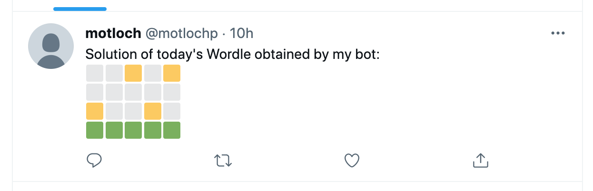

# wordle_bot
A bot that solves a Wordle riddle. 

The script automatic_wordle_bot.py uses selenium to interact with the Wordle website and
solves the riddle in a browser. If there is a "config.yaml" file with proper authentication
information (see "example_config.yaml"), it tweets the squares representing the guessing
process of the bot.

<div align="center">

</div>

The script wordle_bot.py assumes a series of user inputs that encodes the green/yellow/gray squares provided by the website.

Example run:

```
My guess is "ROATE", what is the result? (Green = g, Yellow = y, Gray = x; Example: gyxxy)

Result: yyxxx

My guess is "CUNDY", what is the result? (Green = g, Yellow = y, Gray = x; Example: gyxxy)

Result: xxxxx

My guess is "GIMPS", what is the result? (Green = g, Yellow = y, Gray = x; Example: gyxxy)

Result: xyxyx

Solution is:  PRIOR
```
